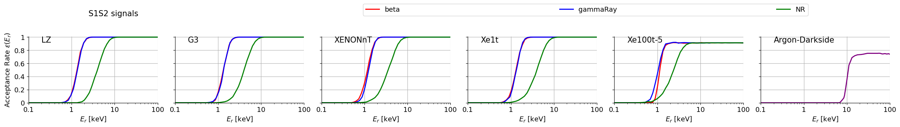

# Detector Efficiency

Detection efficiency curves for liquid xenon, computed via Monte Carlo simulation using [nestpy](https://github.com/NESTCollaboration/nestpy) — the Python bindings for [NEST (Noble Element Simulation Technique)](https://github.com/NESTCollaboration/nest).



## Method

For each detector and interaction type (NR, beta, gammaRay), recoil energies are drawn uniformly over 0–100 keV and passed to nestpy, which returns S1 and S2 signal values for each event. A positive value means the signal was detected; a negative value means it was not. Events are then binned by true recoil energy, and the fraction with valid S1, S2, or both is recorded as the detection efficiency.

This is equivalent to running execNEST with uniform energy input, reimplemented in Python through the nestpy API.

## Detectors

| Detector | Target | Interaction types |
|----------|--------|-------------------|
| LZ | Xenon | NR, beta, gammaRay |
| G3 | Xenon | NR, beta, gammaRay |
| XENONnT | Xenon | NR, beta, gammaRay |
| Xe1t | Xenon | NR, beta, gammaRay |
| Xe100t-5 | Xenon | NR, beta, gammaRay |
| Argon-Darkside | Argon | NR (measured, from [arXiv:1510.00702](https://arxiv.org/abs/1510.00702)) plot for comparison|

## Repository Structure

```
detector_efficiency/    # output .csv efficiency curves (E_center, eff S1, eff S2, eff S1S2)
figures/                # output plots
save_detector_efficiency.py   # reads raw simulation output → saves efficiency .csv
plot_detector_efficiency.py   # reads efficiency .csv → plots and saves figure
```

Raw simulation `.txt` files (~100MB per detector) are not included. They were generated using execNEST via nestpy.

## Related Repositories

This repo is part of a larger set of tools for dark matter and neutrino signal modeling:

```
~/projects/
├── neutrino_spectrum/     ← https://github.com/YZHUANGwork/neutrino_spectrum
├── wimp_spectrum/         ← https://github.com/YZHUANGwork/wimp_spectrum
└── detector_efficiency/   ← this repo
└── phasor_decomp/          ← https://github.com/YZHUANGwork/phasor_decomp
```

## Acknowledgements

Simulation physics provided by [NEST](https://github.com/NESTCollaboration/nest) via [nestpy](https://github.com/NESTCollaboration/nestpy).

> M. Szydagis et al., NEST: A Comprehensive Model for Scintillation Yield in Liquid Xenon, JINST 6 P10002 (2011). [arXiv:1106.1613](https://arxiv.org/abs/1106.1613)
